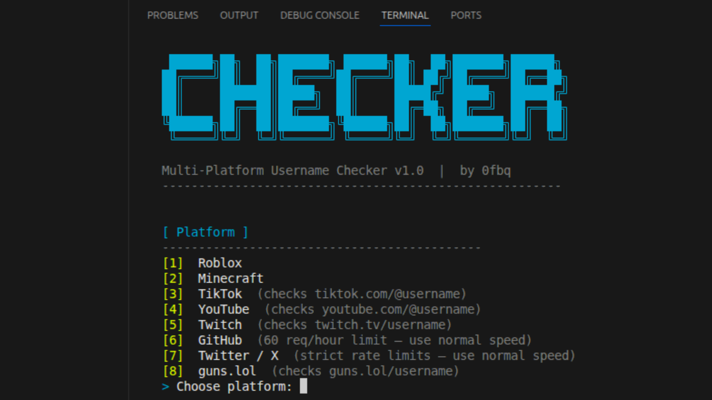

<div align="center">


<br/>

# username-checker

**Multi-platform username checker — find available usernames fast**

[](https://python.org)
[](#)
[](#platforms)
[](#)
[](https://discord.gg/c95uE5ejff)

<br/>

[**Download**](#installation) • [**Platforms**](#platforms) • [**Usage**](#usage) • [**Discord**](https://discord.gg/c95uE5ejff)

</div>

---

## preview

<div align="center">

</div>

---

## video tutorial

<div align="center">

[](https://youtu.be/RQRQRte313Q)

</div>

---

## platforms

| Platform | Method | Min Length | Speed |
|----------|--------|------------|-------|
| Roblox | Official API | 3 letters | Fast |
| Minecraft | Mojang API | 3 letters | Fast |
| TikTok | Profile pages | 4 letters | Medium |
| YouTube | Profile pages | 4 letters | Medium |
| Twitch | Profile pages | 4 letters | Fast |
| GitHub | Official API | 3 letters | Slow (rate limited) |
| Twitter / X | Profile pages | 4 letters | Slow (rate limited) |
| guns.lol | Profile pages | 3 letters | Fast |

---

## features

- 8 platforms supported in one tool
- 3, 4, 5 and 6 letter username checking
- letters only / letters + numbers / letters + underscore / all combined
- load your own custom `.txt` wordlist
- live estimated time remaining while checking
- run again option after finishing — no need to restart
- multithreaded — up to 50 threads
- auto saves results to a separate file per platform
- colored terminal UI
- works on Windows, Mac and Linux

---

## installation

### Windows

**1. clone the repo**
```
git clone https://github.com/40oo/username-checker.git
cd username-checker
```

**2. install dependencies**
```
pip install requests colorama
```

**3. run**
```
python username_checker.py
```

---

### Linux

**1. clone the repo**
```
git clone https://github.com/40oo/username-checker.git
cd username-checker
```

**2. install dependencies**
```
pip3 install requests colorama --break-system-packages
```

**3. run**
```
python3 username_checker.py
```

---

### macOS

**1. clone the repo**
```
git clone https://github.com/40oo/username-checker.git
cd username-checker
```

**2. install dependencies**
```
pip3 install requests colorama
```

**3. run**
```
python3 username_checker.py
```

---

## usage

when you run the tool it asks you step by step:

```
[ Platform ]     pick which platform to check
[ Input Mode ]   generate automatically or load from .txt file
[ Length ]       3, 4, 5 or 6 letters
[ Charset ]      letters / letters+numbers / letters+underscore / all
[ Speed ]        normal / fast / turbo
```

press `ENTER` to start — hits get printed live and saved automatically.
press `Ctrl+C` at any time to stop, results already found are kept.
press `y` when prompted to run again with new settings.

**output files:**
```
available_roblox.txt
available_minecraft.txt
available_tiktok.txt
available_youtube.txt
available_twitch.txt
available_github.txt
available_twitter.txt
available_gunslol.txt
```

---

## custom wordlist

you can load your own `.txt` file instead of generating names automatically:

1. put your `.txt` file in the same folder as `username_checker.py`
2. run the script and choose `[2] Load from custom .txt file`
3. type the filename when asked (e.g. `usernames.txt`)

format — one username per line, lines starting with `#` are ignored:
```
# my custom list
krova
zyx4
nexon
```

---

## tips

- for **GitHub** and **Twitter** use normal speed — they rate limit hard
- for **Roblox** 3-letter names use letters+numbers, pure letters are mostly gone
- results are random every run so everyone checks different names
- if you get lots of `[ERR]` try lowering the thread count
- on Linux if install fails add `--break-system-packages` to the pip command

---

## changelog

**v1.1**
- full Linux and macOS compatibility
- custom .txt wordlist support
- live estimated time remaining
- run again option after finishing
- 3-letter username support
- underscore bug fixed (max 1 per name)
- stability improvements

**v1.0**
- initial release

---

## discord

<div align="center">

[](https://discord.gg/c95uE5ejff)

join for help, updates and to share your finds

</div>

---

## credits

<div align="center">

made by [40oo](https://github.com/40oo)

</div>
